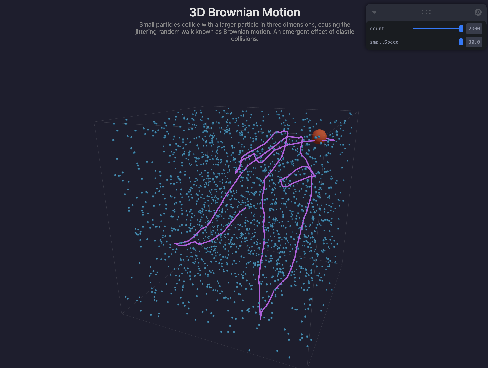

# 3D Brownian Motion

[Live Demo](http://alexeidarmin.com/brownian-motion-3d/)

Small particles collide with a larger particle in three dimensions, causing it to exhibit the jittering random walk known as Brownian motion. An emergent effect of elastic collisions.

